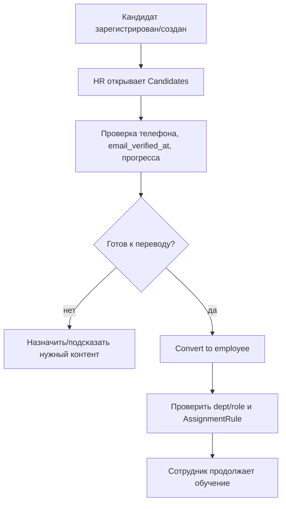

## HR guide — как работать с кандидатами, контентом и модерацией

### Роль HR в системе
- Вести кандидатов: доступ, прогресс, конвертация в сотрудника.
- Поддерживать контент для кандидатов и сотрудников.
- Модерировать комментарии и onboarding feedback.
- Назначать и сопровождать ILP (индивидуальные планы обучения).

---

### Где работать HR
- **HR Hub**: `/analytics/hr/` — основная точка входа.
- **Django Admin**: `/admin/` — расширенное управление моделями.

Рекомендуется начинать с HR Hub, в админку идти для точечных правок.

---

### HR Hub: разделы и назначение
- **Candidates** (`/analytics/hr/candidates/`):
  - список кандидатов;
  - email verification status;
  - прогресс онбординга;
  - действия: mark verified, convert to employee.
- **Visibility** (`/analytics/hr/visibility/`):
  - переключение `visible_for_candidates` для программ/курсов/уроков.
- **Comment moderation** (`/analytics/hr/comments/`):
  - очередь pending-комментариев;
  - approve/reject.
- **Onboarding feedback moderation** (`/analytics/hr/onboarding-feedback/`):
  - очередь pending-отзывов;
  - фильтры по программе/рейтингу/поиску;
  - approve/reject.
- **Content review** (`/analytics/content-review/`):
  - мониторинг контента к ревью/обновлению.

---

### Процесс кандидата (end-to-end)

---

### Кандидаты: что обязательно контролировать
1. Телефон заполнен.
2. Онбординг и базовые курсы доступны кандидату.
3. Прогресс движется (`Onboarding %`, активность входов).
4. При готовности — конвертация в сотрудника.

Подтверждение email:
- Опционально для входа в обучение.
- Можно отметить вручную через HR действия при необходимости.

---

### Видимость контента для кандидатов
Флаги:
- `OnboardingProgram.visible_for_candidates`
- `Course.visible_for_candidates`
- `Lesson.visible_for_candidates`

Мини-проверка перед отправкой кандидата в обучение:
- программа видна;
- курс виден;
- нужный quiz-урок виден;
- под кандидатом открываются `/onboarding/` и `/courses/`.

---

### Модерация (обязательная часть процесса)
- **Комментарии**: публично показываются только после approve HR.
- **Onboarding feedback**: пользователям показываются только approved отзывы.
- Отклонённые материалы не публикуются.

Рекомендуемый SLA:
- Проверять pending-очереди минимум 1 раз в рабочий день.

---

### ILP (Individual Learning Plan)
Где:
- `/admin/` → `Courses → Individual learning plans`.

Как работать:
1. Создать план на пользователя (`is_active=True`).
2. Добавить пункты (`course`/`lesson`/`article`), порядок, обязательность, дедлайны.
3. Отмечать выполнение пунктов.

Что видит сотрудник:
- блок **My Learning Plan** в `/profile/`;
- прогресс, next up, статус пунктов.

---

### Ежедневный HR-чеклист
- Проверить новых кандидатов в HR Hub.
- Проверить pending-комментарии и onboarding feedback.
- Проверить флаги `visible_for_candidates` для нового контента.
- Конвертировать готовых кандидатов и назначить dept/role при необходимости.

